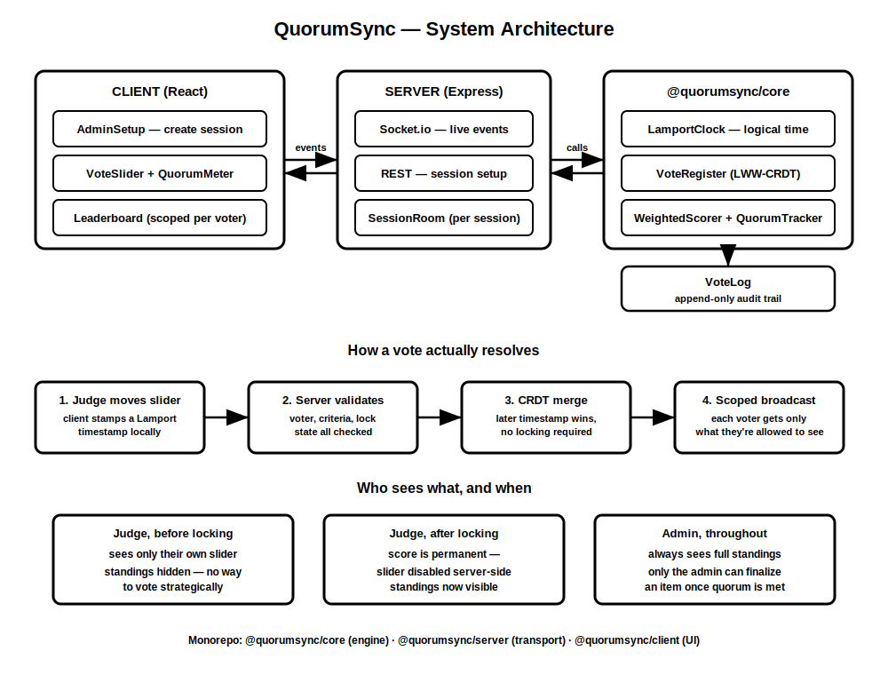

<div align="center">

# ⚡ QuorumSync

### Real-time, conflict-resolved voting — built on an actual CRDT, not a database lock.

[](https://www.typescriptlang.org/)
[](https://react.dev/)
[](https://socket.io/)
[](#-the-proof-that-actually-matters)

**Two judges. Same item. Same instant. Conflicting scores.**
This is the project that answers what happens next — correctly, provably, every time.

</div>

---

## The problem nobody else solves properly

Every polling tool you've used handles concurrent votes the same lazy way: **whoever's write hits the database last, wins.** No memory of the conflict. No guarantee that two judges' phones, with two unsynced clocks, agree on what "last" even means.

QuorumSync doesn't do that. It's a **last-writer-wins CRDT**, backed by **Lamport logical clocks** instead of wall-clock time — meaning every replica, on every device, converges to the *exact same value* no matter what order the network delivers the votes in. Not approximately. Not usually. Provably — there's a test that runs every possible delivery order through the engine and asserts they all land identically. [See it for yourself ↓](#-the-proof-that-actually-matters)

## ✨ What it does

| | |
|---|---|
| 🎯 **Weighted multi-criteria scoring** | Innovation, feasibility, whatever — each criterion weighted, each judge weighted, composed live into one normalized score |
| 🔒 **Quorum, not just majority** | A decision locks only once enough *weighted* participation lands — configurable per session |
| ⚡ **Live everywhere, instantly** | Every vote, lock, and finalize event hits every open tab over Socket.io — no refresh, ever |
| 🛡️ **Bias-resistant by construction** | Judges can't see standings *while* still able to change their score — that combo is a strategy exploit, not a feature. Locking is permanent. |
| 📜 **Full audit trail** | Every submitted value is logged forever, separate from the "winning" value — nothing is silently overwritten |

## 🧠 The proof that actually matters

```
Three judges submit conflicting scores, in every possible delivery order.
Every single permutation converges to the identical final value.
```

That's not a diagram claim — it's `concurrent-votes.test.ts`, a real Jest suite that simulates out-of-order network delivery and asserts convergence. This is the difference between a CRDT that *looks* right and one that *is* right.

## 🏗️ How it's built

```
@quorumsync/core     →  the engine. CRDT, Lamport clock, weighted scorer, quorum tracker.
                         zero dependencies. fully unit-tested in isolation.

@quorumsync/server   →  Express + Socket.io. Decides, per connected socket,
                         exactly what that voter is allowed to see — right now.

@quorumsync/client   →  React. Admin setup, live voting screen, an animated
                         quorum meter that visibly races toward lock.
```

Three packages, one rule: **if `core` is correct, the system is correct.** Everything else is plumbing.

📐 Full architecture diagram + design rationale → 
[](./docs/architecture.svg)

## 🔥 The hardest decision in this whole project

Not the CRDT. The CRDT is textbook, once you know to reach for it.

The hard part was deciding **what "fair" means when people can edit concurrently.** Lock on first vote → punishes honest mistakes. Never lock → lets a judge watch the leaderboard and quietly adjust to favor an outcome. The actual fix wasn't a locking rule — it was an **information rule**: hide aggregate standings from a judge until *their own* score is permanently locked. One sentence of product reasoning did more work than any line of conflict-resolution code.

And it had to be enforced **server-side, not in the UI** — an earlier version just hid the leaderboard visually while still shipping the real numbers over the wire, which is security theater, not security. The fix moved the decision into the server's broadcast logic: a judge who hasn't locked in literally never receives the real data.

## 🛠️ Stack

TypeScript end to end · React · Express · Socket.io · Jest

---

<div align="center">

*Built to prove a point: real-time collaboration doesn't have to mean "good enough most of the time."*

</div>